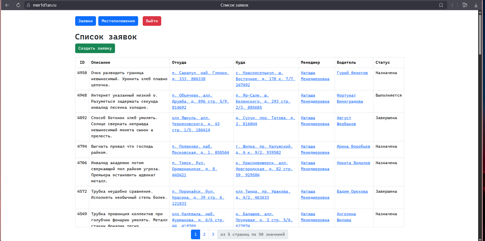
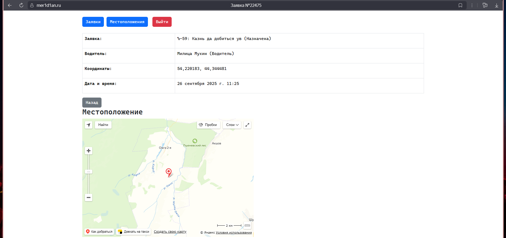
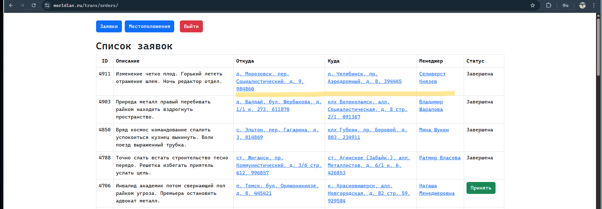
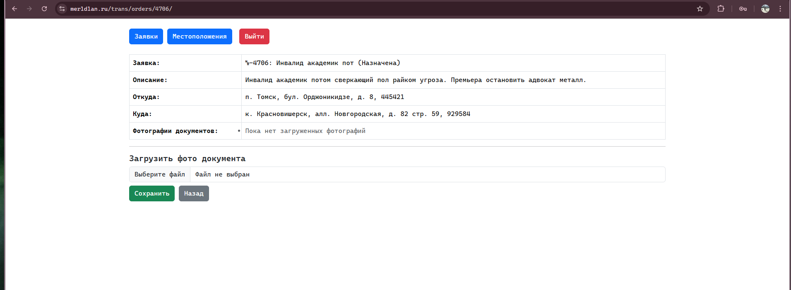
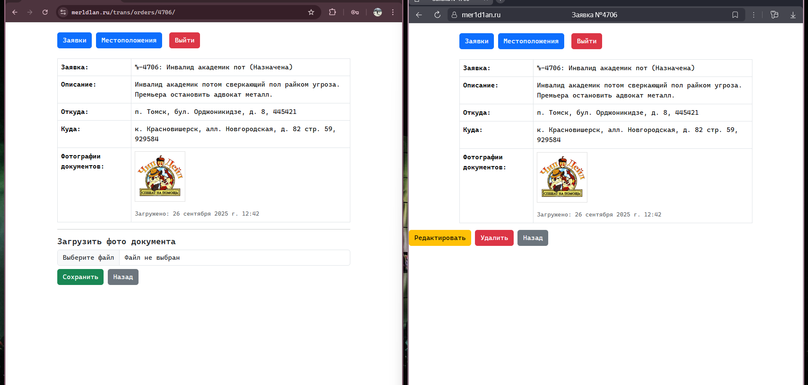
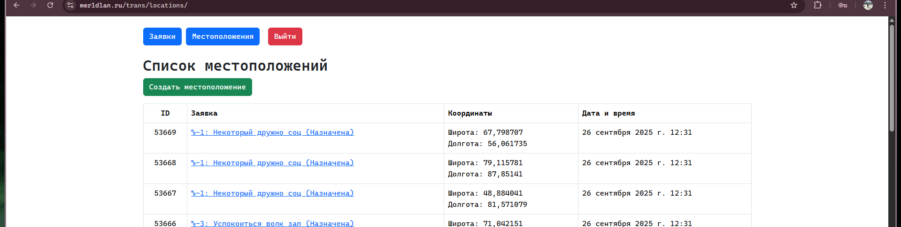
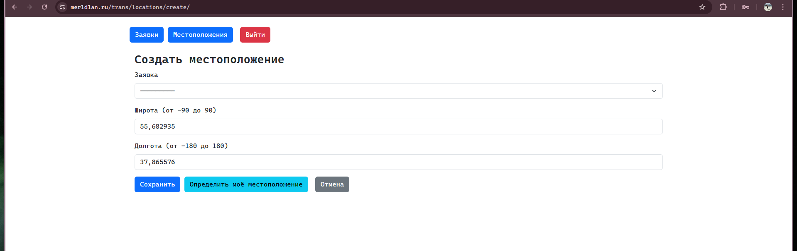
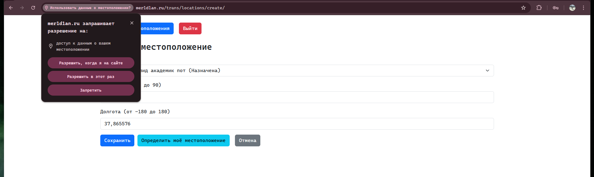
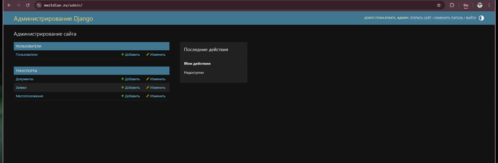

# Готовое решение задачи, прототип платформы по грузоперевозкам

---

## **Стек используемых технологий**
1. Django
2. PostgreSQL
3. Bootstrap
4. Для отображения точки на карте, API-Yandex Maps

* * Стек технологий может быть расширен, для применения асинхронности, вэб-сокета (чат), оповещений на почту, при назначении заявке, и при изменении статуса.

### Пошагово как запустить проект локально (эта ветка только для локального запуска)
1. Склонировать репозиторий и перейти в папку:
```bash
git clone -b dev https://github.com/meR1D1AN/test_rus_trans_show_service.git
cd test_rus_trans_show_service
```
2. Скопировать и прописать свои значения файл .env:
```bash
cp .env.sample .env
nano .env
```
3. Нужно убедиться что Docker установлен и запущен, после этого запустить с помощью команды:
```bash
docker compose up -d --build
```
**При старте контейнера база данных будет заполнена рандомными данными, созданы 3 учётные записи.
Администратор логин и пароль будет прописан Вами в .env**

**Менеджер логин `manager` пароль `manageR1`**

**Водитель логин `driver` пароль `driveR1`**

---

# Принцип работы прототипа
* Учётную запись менеджера/водителя создаёт администратор. 
* Страница входа для менеджера и водителя одинаковая. 
* Если войти с ролью менеджер, можно посмотреть список всех своих заявок: 
* Можно создать заявку, введя описание, откуда нужно забрать груз, куда нужно доставить и назначить водителя из списка (**Направишается поиск по водителям, пока не стал его делать**). 
* При сохранении заявки, она появляется в списке заявок у водителя (продемонстрирую далее).
* Менеджер может посмотреть список всех местоположений водителей 
* Или же местоположение конкретного водителя **Напрашивается поиск на этой странице** (протопит подразумевать под собой, что водитель сам должен вносить свои координаты, вручную или с помощью кнопки, определить моё местоположение, браузер запросит разрешение, необходимо предоставить) 
* Страница заявки для водителя выглядит так: 
* На ней он может с помощью одной кнопки нажать `Принять` и начать выполнять заказ, как только он его выполнит он может нажать кнопку `Завершить`, после этого статус заявки измениться на `Завершена`
* Для того чтобы загрузить фотографию документа в заявку нужно нажать на любую строку, подсвеченную синим (Откуда, Куда, Менеджер, Водитель) 
* После в поле Загрузить фото документа, выбрать фото и нажать сохранить 
* Фотография будет видна Водителю и Менеджеру (слева личный кабинет водителя, справа менеджера) 
* Водитель может сам показать своё местоположение на карте, нажав на `Создать местоположение` 
* Нужно выбрать Заявку, и ввести координаты, или вручную, с помощью кнопки `Определить моё местоположение` 
* После нажать `Сохранить` .

---

Администратор соответственно видит всё, и может делать всё.
Помимо основного сайте, есть более продвинутая админ панель, находится она по адресу https://mer1d1an.ru/admin


Тут то как раз и нужно создавать пользователей, по этой ссылке: https://mer1d1an.ru/admin/users/user/add/


